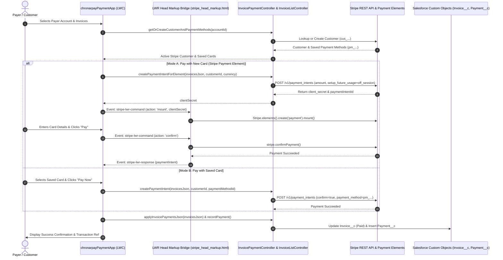

# ChronarPay Payments - Stripe Integration Guide

A complete, production-ready Salesforce & Stripe integration built for source-driven development using Salesforce DX, Lightning Web Components (LWC), Experience Cloud (LWR), and secure Named Credentials.

---

## 📑 Table of Contents

- [Overview & Architecture](#-overview--architecture)
- [Primary Component: `chronarpayPaymentApp`](#-primary-component-chronarpaypaymentapp)
- [Prerequisites](#-prerequisites)
- [Step-by-Step Developer Implementation Guide](#-step-by-step-developer-implementation-guide)
  - [1. Clone & Open Repository](#1-clone--open-repository)
  - [2. Authenticate Dev Hub & Create Scratch Org](#2-authenticate-dev-hub--create-scratch-org)
  - [3. Deploy All Project Metadata](#3-deploy-all-project-metadata)
  - [4. Assign Permission Sets](#4-assign-permission-sets)
  - [5. Configure Stripe Custom Labels & Custom Metadata](#5-configure-stripe-custom-labels--custom-metadata)
  - [6. Configure Named Credentials & External Credentials](#6-configure-named-credentials--external-credentials)
  - [7. Verify CSP Trusted Sites & Remote Site Settings](#7-verify-csp-trusted-sites--remote-site-settings)
  - [8. Configure Experience Cloud LWR Portal (Head Markup Bridge)](#8-configure-experience-cloud-lwr-portal-head-markup-bridge)
  - [9. Add `chronarpayPaymentApp` to Lightning App / Home Pages](#9-add-chronarpaypaymentapp-to-lightning-app--home-pages)
  - [10. Configure Stripe Webhooks (Async Ledger Sync)](#10-configure-stripe-webhooks-async-ledger-sync)
- [Core Workflows in `chronarpayPaymentApp`](#-core-workflows-in-chronarpaypaymentapp)
- [Testing & Verification](#-testing--verification)
- [Complete Project Files & Components](#-complete-project-files--components)
- [Security & PCI Compliance](#-security--pci-compliance)
- [Troubleshooting & FAQs](#-troubleshooting--faqs)

---

## 🏛 Overview & Architecture

ChronarPay Payments integrates Salesforce directly with Stripe using the **Stripe Payment Element** and **Stripe Customer Vault**, ensuring full **PCI-DSS SAQ A compliance** (sensitive credit card numbers and CVV codes never touch Salesforce servers).

### High-Level Architecture:



---

## ⚡ Primary Component: `chronarpayPaymentApp`

The **`chronarpayPaymentApp`** LWC is the central single-page application powering the customer payment portal.

### Key Capabilities:
- **Account Hierarchy**: Switch between Payer Accounts and Sold-To Accounts.
- **Invoice Management**: Real-time filtering by status (`All`, `Open`, `Paid`, `Processing`, `Disputed`) and search by document/reference number.
- **Multi-Invoice Selection**: Select multiple invoices to calculate aggregate totals, automatically factoring in credit memos.
- **Stripe Customer Resolution**: Automatically provisions or resolves Stripe Customers (`cus_...`) per Salesforce Account.
- **Dual Payment Processing**:
  - **Embedded Stripe Payment Element**: Shadow DOM-compatible dynamic card form.
  - **Saved Payment Methods**: Charge saved customer cards or tokenize new cards on file.
- **Transaction History**: View real-time Stripe charges and receipts (`stripeTransactions`).

---

## 📋 Prerequisites

Before starting, ensure you have:

1. **Salesforce CLI (`sf`)**: [Install Salesforce CLI](https://developer.salesforce.com/tools/salesforcecli)
2. **VS Code** with the **Salesforce Extension Pack**
3. **Dev Hub Org**: A Developer Edition or Partner org with **Dev Hub enabled** (`Setup > Dev Hub > Enable Dev Hub`).
4. **Stripe Account**: Access to [Stripe Dashboard](https://dashboard.stripe.com/) in **Test Mode** with:
   - **Publishable Key**: `pk_test_...`
   - **Secret Key**: `sk_test_...` or Restricted Key `rk_test_...`
   - **Webhook Secret**: `whsec_...`

---

## 🚀 Step-by-Step Developer Implementation Guide

### 1. Clone & Open Repository

```bash
git clone https://github.com/your-org/chronarpay-payments.git
cd chronarpay-payments
code .
```

### 2. Authenticate Dev Hub & Create Scratch Org

```bash
# 1. Authorize your Dev Hub org
sf org login web -d -a DevHub

# 2. Create a new scratch org (valid for 30 days)
sf org create scratch -f config/project-scratch-def.json -a ChronarPayScratch -d -y 30
```

### 3. Deploy All Project Metadata

Deploy the complete source tree including Apex classes, LWCs, Custom Objects, Custom Labels, and Custom Metadata:

```bash
sf project deploy start
```

### 4. Assign Permission Sets

Assign permissions for custom objects, Apex controllers, and portal access:

```bash
# Assign primary payment integration permissions to current user
sf org assign permset -n Payment_Integration_Access

# Assign Community Guest Portal permissions (if testing unauthenticated access)
sf org assign permset -n Chronarpay_Payment_Portal_Guest_Access
```

### 5. Configure Stripe Custom Labels & Custom Metadata

`chronarpayPaymentApp` and `InvoicePaymentController` use Custom Labels and Custom Metadata for Stripe configuration:

#### A. Update Custom Labels (`Setup > Custom Labels`):
| Label Name | Value | Description |
|---|---|---|
| `Stripe_Publishable_Key` | `pk_test_...` | Read by `chronarpayPaymentApp.js` to mount Stripe Elements |
| `Stripe_Access_token` | `sk_test_...` | Read by `InvoicePaymentController.cls` for direct API calls |
| `Stripe_End_Point` | `https://api.stripe.com/v1/checkout/sessions` | Stripe Checkout sessions endpoint |

*Or edit locally in `force-app/main/default/labels/CustomLabels.labels-meta.xml` and run `sf project deploy start -m CustomLabels`.*

#### B. Update Custom Metadata (`Setup > Custom Metadata Types > Stripe Setting > Manage Records`):
- Edit the **`Default`** record:
  - **Publishable Key** (`Publishable_Key__c`): `pk_test_...`
  - **Webhook Secret** (`Webhook_Secret__c`): `whsec_...`

---

### 6. Configure Named Credentials & External Credentials

For classes using Named Credentials (`StripeHttpClient.cls` / `StripeService.cls`):

1. Go to **Setup > Named Credentials**.
2. Open the **`stripe`** Named Credential:
   - **URL**: `https://api.stripe.com`
   - **External Credential**: `Stripe`
   - **Headers**:
     - Name: `Authorization`
     - Value: `Bearer <YOUR_STRIPE_SECRET_KEY>` *(e.g. `Bearer sk_test_...`)*
3. In **Setup > External Credentials > Stripe**, ensure Principal access is mapped.

---

### 7. Verify CSP Trusted Sites & Remote Site Settings

Ensure outgoing callouts and frontend scripts are allowed:

1. **CSP Trusted Sites** (`Setup > CSP Trusted Sites`):
   - `StripeJS`: `https://js.stripe.com` (Ensure all directives like `connect-src`, `frame-src`, `script-src`, `style-src` are checked).
2. **Remote Site Settings** (`Setup > Remote Site Settings`):
   - `Stripe`: `https://api.stripe.com` (Active).
   - `StripeAPI`: `https://api.stripe.com` (Active).

---

### 8. Configure Experience Cloud LWR Portal (Head Markup Bridge)

To run `chronarpayPaymentApp` inside an Experience Cloud LWR / Community site:

1. Go to **Setup > Digital Experiences > All Sites**.
2. Click **Builder** next to **Invoice Payment Portal** (or **Chronarpay Payment Portal**).
3. Click the **Settings (⚙️)** icon -> **Advanced** -> **Edit Head Markup**.
4. Paste the entire content of [`stripe_head_markup.html`](file:///c:/Chronarpay%20Payments/stripe_head_markup.html).
   - *Purpose:* Bypasses Shadow DOM encapsulation and provides the `stripe-lwr-command` and `stripe-lwr-response` event bridge for `chronarpayPaymentApp`.
5. Click **Save** and **Publish** the site.
6. Drag and drop the **`Chronarpay Payment App`** component onto your portal page.

---

### 9. Add `chronarpayPaymentApp` to Lightning App / Home Pages

To use `chronarpayPaymentApp` within standard Lightning Experience:

1. Navigate to **App Launcher > Invoice Payments app**.
2. Go to **Setup > Edit Page** on the Home or App Page.
3. Drag the **`chronarpayPaymentApp`** component onto the canvas and save/activate.

---

### 10. Configure Stripe Webhooks (Async Ledger Sync)

To receive real-time status updates for off-session payments and disputes:

1. In [Stripe Dashboard > Webhooks](https://dashboard.stripe.com/test/webhooks), click **Add Endpoint**.
2. **Endpoint URL**: `https://<your-salesforce-site-domain>/services/apexrest/stripeWebhook`
3. **Events to listen for**:
   - `payment_intent.succeeded`
   - `payment_intent.payment_failed`
   - `charge.refunded`
4. Copy the Signing Secret (`whsec_...`) and update `Stripe_Settings__mdt.Webhook_Secret__c`.

---

## 💡 Core Workflows in `chronarpayPaymentApp`

```
┌───────────────────────────────────────────────────────────────┐
│                    chronarpayPaymentApp                       │
├──────────────────────────────┬────────────────────────────────┤
│ 1. Payer / Account Selection │ Switch Payer & Sold-To accounts│
├──────────────────────────────┼────────────────────────────────┤
│ 2. Invoices Dashboard        │ Filter Open/Paid, Search,      │
│                              │ Multi-select for bulk pay      │
├──────────────────────────────┼────────────────────────────────┤
│ 3. Payment Mode Selection    │ • Mode A: Stripe Elements      │
│                              │ • Mode B: Saved Card (Vault)   │
├──────────────────────────────┼────────────────────────────────┤
│ 4. Transaction History       │ Live list of Stripe charges    │
└──────────────────────────────┴────────────────────────────────┘
```

### Unconfirmed Intent Flow (Mode A)
1. `chronarpayPaymentApp.js` invokes `createPaymentIntentForElement()` passing selected invoices.
2. Apex creates an unconfirmed `PaymentIntent` with `automatic_payment_methods=true` and `setup_future_usage=off_session`.
3. LWC sends `mount` command to the head markup script with `clientSecret`.
4. Stripe Payment Element mounts securely inside the component container.
5. On submit, `stripe.confirmPayment()` is executed.
6. Upon confirmation, `applyInvoicePaymentsJson()` updates Salesforce invoice records.

---

## 🧪 Testing & Verification

### 1. Test Apex Connection
```bash
sf apex run -e "System.debug(StripeController.testStripeConnection());"
```

### 2. Run Apex Unit Tests
```bash
sf apex run test -c -r human -n "InvoicePaymentControllerTest,InvoiceListControllerTest,StripeControllerTest,paymentServiesTest"
```

### 3. End-to-End Payment Test (Stripe Test Cards)
| Card Type | Number | Exp | CVC | Expected Result |
|---|---|---|---|---|
| **Standard Visa** | `4242 4242 4242 4242` | `12/34` | `123` | Succeeded |
| **Declined Card** | `4000 0000 0000 0002` | `12/34` | `123` | Card Declined |
| **3D Secure (3DS)** | `4000 0000 0000 3155` | `12/34` | `123` | Triggers 3DS Modal |

---

## 📁 Project Structure & Key Files

```
├──config/
│   └── project-scratch-def.json           # Scratch org definition
│ force-app/main/default/
│   ├── applications/
│   │   └── Invoice_Payments_app.app-meta.xml # Lightning app bundling invoice and payment tabs
│   ├── classes/
│   │   ├── InvoicePaymentController.cls   # Core payment engine (PaymentIntents, customer vault, saved cards)
│   │   ├── InvoiceListController.cls      # Payer & Sold-To account queries, invoice retrieval & ledger settlement
│   │   ├── StripeController.cls           # AuraEnabled controller exposing APIs to LWC
│   │   ├── StripeService.cls              # Business logic, currency conversions & validation
│   │   ├── StripeHttpClient.cls           # Low-level HTTP client routing requests to callout:stripe
│   │   ├── StripeDTO.cls                  # Request/Response data transfer objects
│   │   ├── StripeException.cls            # Custom exception handling
│   │   └── StripeWebhook.cls              # REST Webhook listener (@RestResource)
│   ├── customMetadata/
│   │   └── Stripe_Settings.Default.md-meta.xml # Publishable key & webhook secret metadata
│   ├── labels/
│   │   └── CustomLabels.labels-meta.xml   # Stripe publishable key, access token & endpoints
│   ├── cspTrustedSites/
│   │   └── StripeJS.cspTrustedSite-meta.xml # CSP rule allowing https://js.stripe.com
│   ├── remoteSiteSettings/
│   │   └── Stripe.remoteSite-meta.xml     # Remote Site Setting for Stripe API endpoints
│   ├── namedCredentials/
│   │   └── stripe.namedCredential-meta.xml # Named Credential for Stripe REST API
│   ├── externalCredentials/
│   │   └── Stripe.externalCredential-meta.xml # External Credential definition
│   ├── lwc/
│   │   ├── chronarpayPaymentApp/          # Primary ChronarPay portal SPA (Invoices, Stripe Elements, Saved Cards)
│   │   ├── stripePayment/                 # Core Stripe Payment Element LWC
│   │   ├── paymentSuccess/                # Stripe checkout redirect success view
│   │   └── paymentCancel/                 # Stripe checkout redirect cancellation view
│   └── permissionsets/
│       ├── Payment_Integration_Access.permissionset-meta.xml # Standard user & admin permissions
│       └── Chronarpay_Payment_Portal_Guest_Access.permissionset-meta.xml # Guest portal access permissions
├── stripe_head_markup.html                # LWR Experience Builder Head Markup script (Shadow DOM bridge)
└── sfdx-project.json                      # SFDX Project configuration
```

---

## 🔒 Security & PCI Compliance

- **Zero Sensitive Data Stored**: Card numbers, CVV codes, and expiry dates are tokenized directly in Stripe's iframe elements.
- **Isolated Callouts**: Secret API keys are managed through Salesforce Named Credentials and protected Custom Labels.
- **Transport Security**: All communications use TLS 1.3 to `https://api.stripe.com`.
- **Permission Boundaries**: Custom objects and Apex methods require `Payment_Integration_Access`.

---

## ❓ Troubleshooting & FAQs

| Issue | Root Cause | Solution |
|---|---|---|
| **Stripe.js failed to load** | CSP Trusted Site missing or blocked | Verify `StripeJS` CSP site exists in Setup and all directives (`script-src`, `connect-src`, `frame-src`) are enabled. |
| **HTTP 401 Unauthorized / Invalid API Key** | Missing or incorrect token in Custom Label / Named Credential | Update `Stripe_Access_token` in Custom Labels and the Authorization header in the `stripe` Named Credential with your valid `sk_test_...` key. |
| **Payment Element does not mount in LWR** | Shadow DOM encapsulation blocking element mounting | Ensure `stripe_head_markup.html` is pasted into Experience Builder Head Markup and the site is published. |
| **Stripe customer not found** | Account not yet provisioned in Stripe | `chronarpayPaymentApp` will automatically create a Stripe Customer upon invoice selection via `getOrCreateCustomerAndPaymentMethods()`. |
| **Total payment amount must be greater than zero** | Selected invoices have 0 or negative balance after credits | Select at least one invoice with an outstanding open balance. |

---

*ChronarPay Payments Integration — Maintained for Salesforce DX Developers.*
